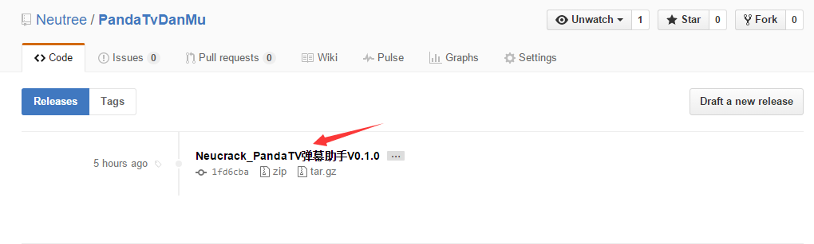
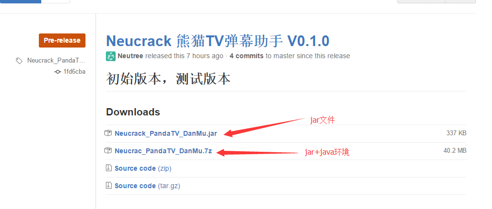

# PandaTvDanMu
Panda TV  弹幕助手 （ 熊猫TV 弹幕助手） （JAVA）

## 使用方法
因为是使用的java语言进行编写，可以在不同系统上运行，运行软件需要java虚拟机，所以有如下两种方法 
###### （1） 针对电脑上已经有java环境的或者是想单独先把java环境装好的
* <a href="https://github.com/Neutree/PandaTvDanMu/releases" target="_blank">点我</a>找到最新版本，下载jar文件
* 如果电脑上没装过java环境，请下载安装
* 运行jar文件，理论上即可。如果不能打开，请搜索“运行jar”

###### （2）包含运行环境，下载直接双击运行
* <a href="https://github.com/Neutree/PandaTvDanMu/releases" target="_blank">点我</a>找到最新版本，点进去直接下载打包好的7z压缩包（里面包含了java运行环境，无需额外安装java环境），然后解压到一个文件夹下，然后双击<kbd>运行Neucrack熊猫TV弹幕助手.bat</kbd>运行即可。

###### 注意：
* 下载文件别下错了哦！在这里 
 
需要点击对应版本的标题，进去之后下载 
 
没有java环境的第一次下载了7z压缩包，后面更新就不用下载了，直接下载最新的.jar文件覆盖文件夹中的.jar文件就行了

## 反馈与参与
* 如果有疑问或者有建议，欢迎添加issu，不会用github（这个网站）的，可以到[这里](http://blog.neucrack.com/index.php/archives/233)评论
* 可以pull request，哪怕一点改进也会通过滴
